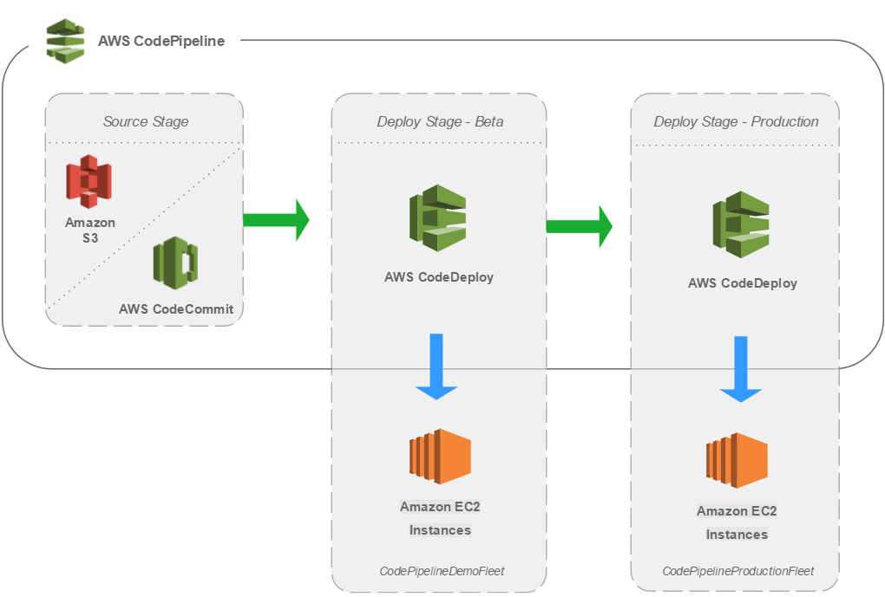

# AWS 개발 환경 구축 (서버 배포 자동화)



사진 출처: [Set Up a CI/CD Pipeline on AWS](https://aws.amazon.com/getting-started/hands-on/set-up-ci-cd-pipeline/)

<br/>

## AWS 배포 자동화 파이프라인을 구축하기 위한 3 단계

위 사진과 같이 CodePipeline을 이용해서 각 단계(CodeCommit, CodeBuild, CodeDeploy)를 연결하는 파이프라인을 구축한다.

<br/>

| CodeCommit                     | CodeBuild                                                                                 | CodeDeploy                                                                       |
| ------------------------------ | ----------------------------------------------------------------------------------------- | -------------------------------------------------------------------------------- |
| Source 단계 + Github           | Build 단계                                                                                | Deploy 단계                                                                      |
| Github 에 push 하면 감지, 작동 | 배포하기 전에 꼭 필요한 일을 하는 단계                                                    | 배포가 끝나고 나서 필요한 일을 하는 단계                                         |
|                                | HTML, CSS, JS, JSX → HTML, JS 로 번들링/빌드해서 어떤 브라우저에서도 작동할 수 있게 한다. | e.g. E2E 테스트                                                                  |
|                                | 환경 변수 설정 (클라이언트에서 서버로 연결할 때 필요)                                     | EC2 및 on-premise 에 적용 가능                                                   |
|                                | Pipeline 없이도 사용 가능                                                                 | 인스턴스에 코드를 배포, 배포 LifeCycle에 따른 스크립트 실행 → `AppSpec.yml` 활용 |
|                                | 빌드한 결과물 자동 생성 및 전달                                                           |                                                                                  |

<br/>
<br/>

## ⚙️ EC2 인스턴스 생성 후 개발 환경 구축

EC2 인스턴스를 생성한 뒤 터미널을 통해 EC2 인스턴스에 접속해서 개발환경을 구축한다. (nvm, npm, node.js 를 설치)

<br/>

### node.js 기반 서버 실행을 위한 개발 환경 구축

- 아래 명령어 입력를 입력해서 터미널을 bash로 변경한다.

  ```shell
  bash

  cd ~
  ```

- 아래 명령어를 입력해서 패키지 매니저가 관리하는 패키지의 정보를 최신 상태로 업데이트한다.

  ```shell
  sudo apt update
  ```

- nvm 설치를 위해 아래 명령어를 터미널에 순차적으로 입력한다.

  [https://github.com/nvm-sh/nvm](https://github.com/nvm-sh/nvm)

  ```shell
  curl -o- [https://raw.githubusercontent.com/nvm-sh/nvm/v0.39.1/install.sh](https://raw.githubusercontent.com/nvm-sh/nvm/v0.39.1/install.sh) | bash
  ```

  ```bash
  export NVM_DIR="$([ -z "${XDG_CONFIG_HOME-}" ] && printf %s "${HOME}/.nvm" || printf %s "${XDG_CONFIG_HOME}/nvm")"
  [ -s "$NVM_DIR/nvm.sh" ] && \. "$NVM_DIR/nvm.sh" # This loads nvm
  ```

- nvm 설치가 완료되었으면 node.js 를 설치한다.

  ```shell
  nvm install node
  ```

  → `node --version` : 설치된 node.js 의 버전을 확인할 수 있다.

- node.js 설치 완료 후 npm 설치를 한다. (sudo 로 명령하는 것은 npm 명령어 입력이 정상적으로 되지 않을 때를 위함)

<br/>
<br/>

## PM2 (Process Manager 2)

PM2는 node.js 를 위한 프로세스 매니지먼트 툴로, SSH나 서비스 매니저로 프로세스를 켜지 않아도 background에서 프로세스를 작동시킬 수 있다.

아래 명령어를 순차적으로 입력해서 PM2 를 설치한다.

[설치방법 PM2 공식문서 참고](https://pm2.keymetrics.io/docs/usage/quick-start/)

```shell
npm install pm2 -g

sudo apt-get install authbind

sudo touch /etc/authbind/byport/80

sudo chown ubuntu /etc/authbind/byport/80

sudo chmod 755 /etc/authbind/byport/80

authbind --deep pm2 update

authbind --deep pm2 start app.js
```

### `chown`

- Linux의 기본 명령어 중 하나로, 'change owner'의 축약어이다.
- Linux에서 파일은 특정 owner 또는 group에 속해있는데 이를 변경하는 명령어이다.

### `chmod`

- Linux의 기본 명령어 중 하나로, 'change mode'의 축약어이다.
- 파일의 권한을 설정할 수 있다.
- chmod 뒤에 오는 3자리 숫자는 처음부터 순서대로 소유자 권한 / 그룹 권한 / 전체 권한을 의미한다. 아래의 세 가지 숫자의 조합으로 권한을 부여한다.

  (e.g. chmod 700 -> 소유자의 권한은 (4+2+1) 이다. 즉, 읽기 + 쓰기 + 실행 권한을 부여한다.)

  - 4: 읽기
  - 2: 쓰기
  - 1: 실행

<br/>

## References

- https://docs.aws.amazon.com/codepipeline/latest/userguide/best-practices.html

- https://pm2.keymetrics.io/docs/usage/quick-start/

- https://en.wikipedia.org/wiki/Chmod
