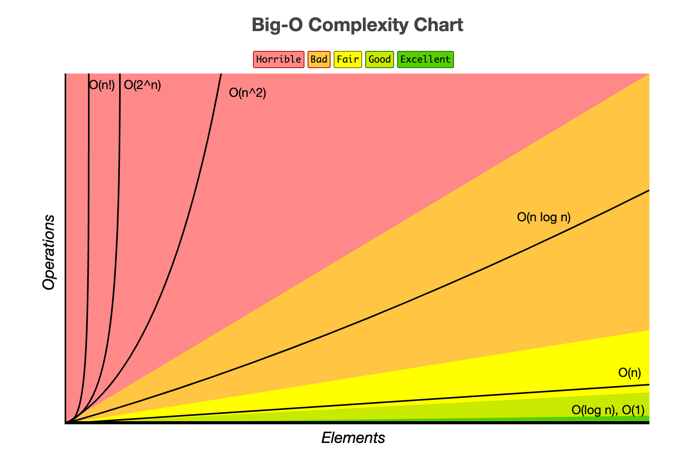

# Big O Notation

# Time Complexity (시간 복잡도)



[Big-O Complexity Chart Reference](https://www.bigocheatsheet.com/)

<br/>

코드의 성능, 효율성을 평가하기 위한 객관적인 척도로 쓰인다.

input이 증가함에 따라 알고리즘 실행 시간이 어떻게 되는지 설명해주는 공식적인 방식이다.

> Big O는 input(입력 값)의 크기와 실행 시간의 관계를 말한다. <br/> 여기서 실행 시간은 **worst case(가장 긴 실행 시간)** 을 말한다.

코드가 실행될 때 걸리는 시간으로 측정하는 것이 아닌, 컴퓨터가 실행해야 하는**연산 개수로 측정**한다. 그 이유는 컴퓨터의 사양에 따라 시간은 다르게 나오지만, 연산 개수는 변하지 않기 때문이다.

<br/>

### 🕖 시간 복잡도 순서

`O(1)` < `O(log n)` < `O(n)` < `O(n log n)` < `O(n²)` < `O(n³)` < `O(2ⁿ)` < `O(n!)`

<br/>
<br/>

## O(1)

```js
function addUpTo(n) {
	return (n * (n + 1)) / 2;
}

// 이 코드의 연산 개수는 항상 3 개이다. (곱셈, 덧셈, 나눗셈)
// n의 값은 연산 개수와는 상관이 없다.
```

위의 코드는 연산 개수는 정해져 있기 때문에, n으로 어떤 값이 들어가던지 연산 개수에 영향을 주지 않는다. → `O(1)`

<br/>
<br/>

## O(n)

```js
function addUpTo(n) {
	let total = 0;
	for (let i = 1; i <= n; i++) {
		total += i; // + 연산, = 할당(연산) --> 연산 개수: 2
	}
	return total;
}

//
// +과 = 는 반복문 안에 있기 때문에, 반복문을 몇 번 순회하는지에 따라 연산 개수가 달라진다.
```

```js
function upAndDown(n) {
	for (let i = 0; i < n; i++) {
		console.log(i);
	}
	for (let j = n - 1; j >= 0; j--) {
		console.log(j);
	}
}

// 반복문이 2번 실행된다. (중첩이 아닌 것에 주목!)
```

> 연산 개수를 셀때는 모든 연산을 세는 것이 아니라, 연산 증가 추세를 보는 것이 더 중요하다.

그래서 반복문으로 구현한 addUpTo 함수의 경우, n이 커질 수록 연산의 개수도 비례하면서 증가한다. → `O(n)`

반복문이 두 번 실행되는 upAndDown 함수는 `O(2n)` 이라고 할 수 있다. 이 경우에는 2n 든지, 10n 이든지 모두 `O(n)` 으로 단순하게 표기한다.

<br/>
<br/>

## O(n²)

```js
function printAllPairs(n) {
	for (let i = 0; i < n; i++) {
		for (let j = 0; j < n; j++) {
			console.log(i, j);
		}
	}
}
```

**중첩된 반복문**은 input이 커질 수록 실행 시간이 n의 제곱으로 늘어난다.

즉, `O(n * n)` 이다. → `O(n²)`

<br/>

`O(n² + 5n + 8)` 의 경우도 마찬가지로, n² 에 비해 5n + 8은 상대적으로 작다.

따라서 `O(n²)` 으로 단순화해서 표기한다.

<br/>

### 💁🏻‍♀️ 헷갈릴 수 있는 예제들

```js
function logAtLeast5(n) {
	for (let i = 1; i <= Math.max(5, n); i++) {
		console.log(i);
	}
}

// O(n)
```

위의 반복문은 조건식이 `i <= Math.max(5, n)` 이다.

즉 n이 5 이상이 되면 n만큼 반복문을 순회해야 하기 때문에 logAtLeast5 함수의 Big O 표기법은 `O(n)` 이 된다.

<br/>

```js
function logAtMost5(n) {
	for (let i = 1; i <= Math.min(5, n); i++) {
		console.log(i);
	}
}
// O(1)
```

logAtMost5 함수는 조금 다르다. 조건식이 `i <= Math.min(5, n)` 이기 때문에, n이 5이상이 되어도 **항상 5번**만 순회하는 반복문이 된다.

그러므로 Big O 표기법은 `O(1)` 이 된다.

<br/>
<br/>

## O(log n)

일부 탐색 알고리즘과 정렬 알고리즘에서 쓰이는 알고리즘의 시간 복잡도는 `O(log n)`이다.

<br/>
<br/>

# Space Complexity (공간 복잡도)

> input(입력 값)을 제외하고 **알고리즘 자체가 필요로 하는 공간(메모리)** 을 말한다.

|                                                  `O(1)`                                                  |                                     `O(n)`                                     |    `O(log n)`    |
| :------------------------------------------------------------------------------------------------------: | :----------------------------------------------------------------------------: | :--------------: |
| `number`, `boolean`, `undefined`, `null` 과 같은 원시 타입들은(string 제외) 항상 일정한 공간을 차지한다. | `string`, `array`, `object` 은 데이터가 차지하는 만큼(n)의 공간을 필요로 한다. | Recursion (재귀) |
|                                                                                                          |           `string`, `array` 는 문자열 또는 배열의 길이(n) 만큼 차지            |                  |
|                                                                                                          |                      `object` 는 key의 개수(n) 만큼 차지                       |                  |

```js
function sum(arr) {
	let total = 0; // 공간 1

	for (let i = 0; i < arr.length; i++) {
		// i = 0 --> 공간 2
		total += arr[i];
	}
	return total;
}

// 입력의 크기(이 예제에서는 arr) 와는 상관 없이 일정한 공간을 차지한다.
// 공간 복잡도 : O(1)
```

```js
function double(arr) {
	let newArr = []; // 새로운 배열을 만든다.

	for (let i = 0; i < arr.length; i++) {
		newArr.push(2 * arr[i]); // 이렇게 만들어진 새 배열의 크기는, 입력받은 arr의 크기와 비례해서 커진다.
	}
	return newArr;
}

// 공간 복잡도 : O(n)
```

<br/>
<br/>

## Reference

- [Udemy JavaScript 알고리즘 & 자료구조 마스터클래스](https://www.udemy.com/course/best-javascript-data-structures/learn/lecture/28559303?start=0#overview)

- [Big-O Complexity Chart Reference](https://www.bigocheatsheet.com/)
