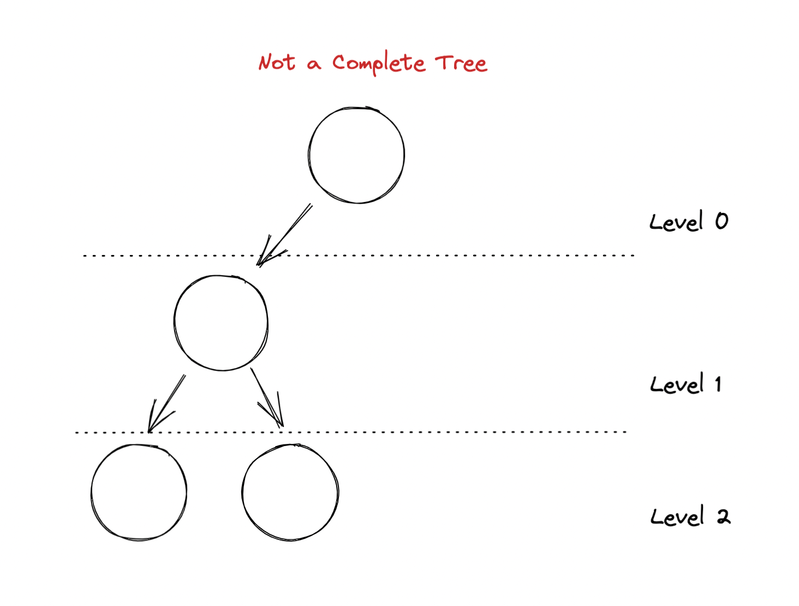
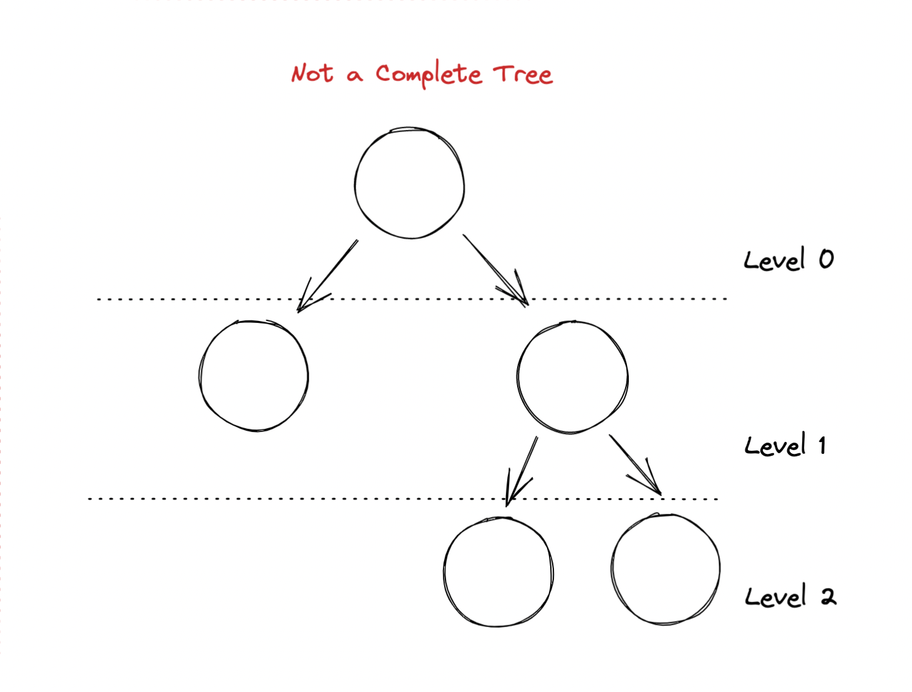
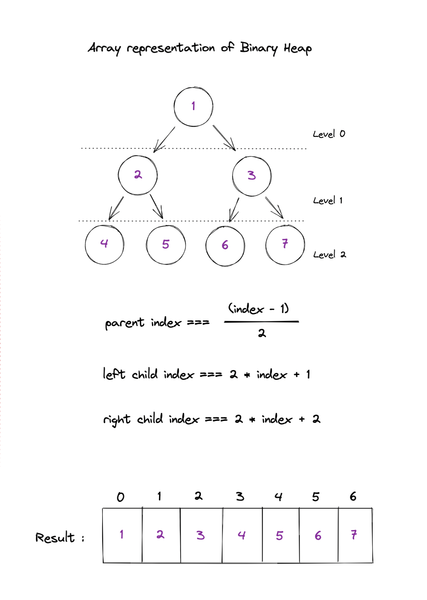

# Binary Heaps

Binary Heap has a **tree data structure**.

There are two types of binary heaps:

- Min-heap
- Max-heap

<br/>
<br/>

## Binary Heap Properties

---

Binary heaps must have these properties:

- Every parent node, at most, can have only **2 children**.
- Must be a **complete tree**.
  - It must be filled from left to right
  - **Every level must be full**, with the exception of the last level not needing to be full.
- Min-heap: Every parent's key must be **smaller** than its children nodes
  - Root node is always the smallest key within the heap
- Max-heap: Every parent's key must be **greater** than its children nodes. (opposite of min-heap)
  - Root node is always the largest within the heap





<br/>
<br/>

> **Heapify** is the process of creating a heap data structure from a binary tree. It is used to create a Min-Heap or a Max-Heap.

<br/>
<br/>

## Insert & Remove

---

### Inserting within Min-Heap

- Swap parent node and children node if parent node is greater than children node.

<br/>

### Removing Minimum Element

- Minimum element in Min-Heap will be the root node.
- Remove root node, then replace it with its children node.
- If root node is greater than children node, then swap.

<br/>
<br/>

## How to represent a heap using an array

---

To calculate the index of a given node:

`parent index === Math.floor((index - 1) / 2)`

`left child index === 2 * index + 1`

`right child index === 2 * index + 2`



<br/>
<br/>

## Min-Heap

---

constructor

```js
class MinHeap {
	constructor() {
		this.storage = []; // place to store data. implement heap using an array
		this.size = 0; // number of elements currently in heap
	}
}
```

<br/>

helper methods

```js
getParentIndex(index){
  return Math.floor((index - 1) / 2);
}

getLeftChildIndex(index){
  return 2 * index + 1;
}

getRightChildIndex(index){
  return 2 * index + 2;
}

hasParent(index){
  return this.getParentIndex(index) >= 0;
  // true -> has parent
  // false -> no parent
}

hasLeftChild(index){
  return this.getLeftChildIndex(index) < this.size;
  // if the left child index is greater than the size attribute, it can't have a child.
  // size attribute is the number of elements within the heap.
}

hasRightChild(index){
  return this.getRightChildIndex(index) < this.size;
}

parent(index){
  return this.storage[this.getParentIndex(index)];
}

leftChild(index){
  return this.storage[this.getLeftChildIndex(index)];
}

rightChild(index){
  return this.storage[this.getRightChildIndex(index)];
}

swap(index1, index2){
  let temp = this.storage[index1];
  this.storage[index1] = this.storage[index2];
  this.storage[index2] = temp;
}
```

<br/>

## Min-Heap: Insertion

### Iterative version

```js
insert(data){
  this.storage[this.size] = data;
  this.size += 1; // increment the size
  this.heapifyUp(); // make sure data is stored in the right position
}

heapifyUp(){
  let index = this.size - 1;
  // as long as the parent element is greater than the current node element
  while(this.hasParent(index) && this.parent(index) > this.storage[index]) {
    // if it is, swap to maintain the min-heap property (parent must be less than the child)
    this.swap(this.getParentIndex(index), index);
    // continue advancing up the tree
    index = this.getParentIndex(index);
  }
}
```

<br/>

### Recursive version

Since tree is naturally recursive, heapify method can be implemented recursively.

```js
insert(data){
  this.storage[this.size] = data;
  this.size += 1;
  this.heapifyUp(this.size - 1); // pass the index of the last element just inserted above
}

heapifyUp(index){ // pass index as an argument -> no longer to calculate the index within heapifyUp method
  if(this.hasParent(index) && this.parent(index) > this.storage[index]) {
    this.swap(this.getParentIndex(index), index); // if the condition is true, swap the data between the two nodes
    this.heapifyUp(this.getParentIndex(index)); // recursively clime the tree by passing parent index to heapifyUp method
  }
}
```

<br/>
<br/>

### References

- https://www.youtube.com/watch?v=ifNlv0N5wT8&ab_channel=NoobCoder
- Heapify definition: https://www.programiz.com/dsa/heap-data-structure
