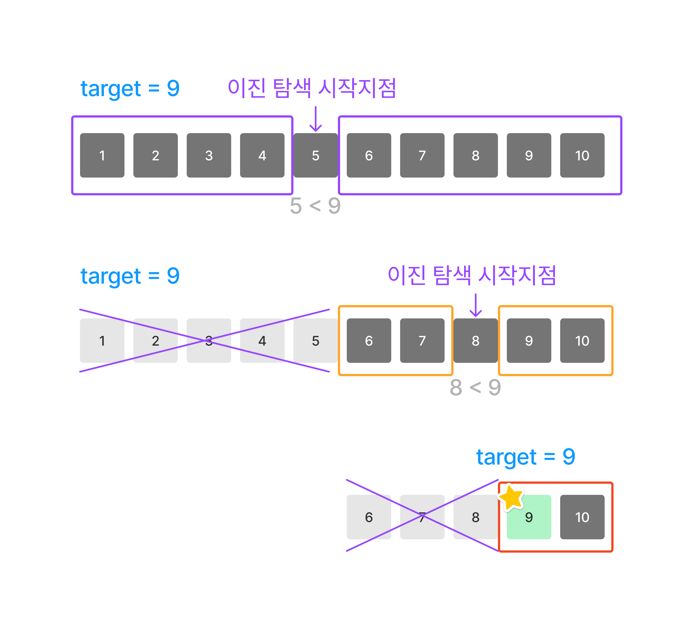

# 🔍 이진 탐색 (binary search)

> _이진 탐색에서 '이진'은 0과 1을 의미하는 것이 아닌, 하나를 둘로 나누는 것을 의미한다._

<p> 이진 탐색(binary search)은 선형 탐색 (linear search) 과 함께 탐색 알고리즘 (search algorithm)에 속한다.</p>

<p> 선형 탐색은 모든 배열에서 사용이 가능하지만, 이진 탐색은 **Sorted array(정렬된 배열) 에서만 사용이 가능**하다.</p>

<p> 이진 탐색의 시간복잡도는 **O(log N)** 이다.  
정렬된 배열에서의 탐색은 정렬이 안된 배열에서의 탐색보다 훨씬 빠르다.
하지만 정렬된 배열에서의 요소의 추가는, 정렬이 안된 배열에서 요소를 추가하는 것보다 시간이 더 소요된다.</p>

|         선형 탐색         |                 이진 탐색                 |
| :-----------------------: | :---------------------------------------: |
|  모든 배열에서 사용 가능  | 정렬된 배열(sorted array)에서만 사용 가능 |
| 데이터가 많을 때 비효율적 |          데이터가 많을 때 효율적          |
|           O(N)            |                 O(log N)                  |

<br/>
<!-- 이진 탐색에서 임의의 숫자 n을 정렬된 배열에 추가하는 상황을 가정해보자. -->

## 🧐 이진 탐색의 메커니즘

아래 사진을 참고해서 이진 탐색의 알고리즘을 이해해보자.



이진 탐색은 정렬된 배열의 **정중앙(midpoint) 부터 탐색을 시작**한다. (_인덱스 0 부터가 아니다!_)
그리고 탐색의 대상이 되는 target과 정중앙에 있는 숫자(n) 와의 크기를 비교한다.

- **n > target** 이라면, 배열의 왼쪽을 탐색한다. (오른쪽은 탐색에서 제외시킨다.)

- **n < target** 이라면, 배열의 오른쪽을 탐색한다. (왼쪽은 탐색에서 제외시킨다.)

이렇게 배열을 반으로 쪼개어 비교하는 과정을 target 을 찾을 때 까지 계속 반복한다.  
이진 탐색은 배열을 반으로 쪼개는 스텝을 거칠 때마다 절반의 요소를 없애기 때문에 탐색을 수행하는 속도가 빠르다.

> 탐색을 해야 하는 데이터의 양이 2배가 늘어도, 작업을 수행하는데 필요한 스텝은 1번만 더 추가된다.

<p>그래서 이진 탐색은 엄청난 양의 데이터가 있는 배열을 다룰때 굉장히 효율적이다. </p>
<br/>

## 👩🏻‍💻 이 알고리즘을 그대로 코드로 옮기면?

오름차순으로 정렬된 배열 array와, 그 배열에서 탐색해야 하는 요소 target 이 있다.
target의 인덱스를 리턴해야 한다면 아래와 같이 작성할 수 있다.

```js
function binarySearch(array, target) {
	let left = 0;
	let right = array.length - 1;

	while (left <= right) {
		let mid = Math.floor((left + right) / 2);

		if (array[mid] === target) {
			return mid;
		} else if (array[mid] > target) {
			right = mid - 1;
		} else if (array[mid] < target) {
			left = mid + 1;
		}
	}
	return -1;
}
```
