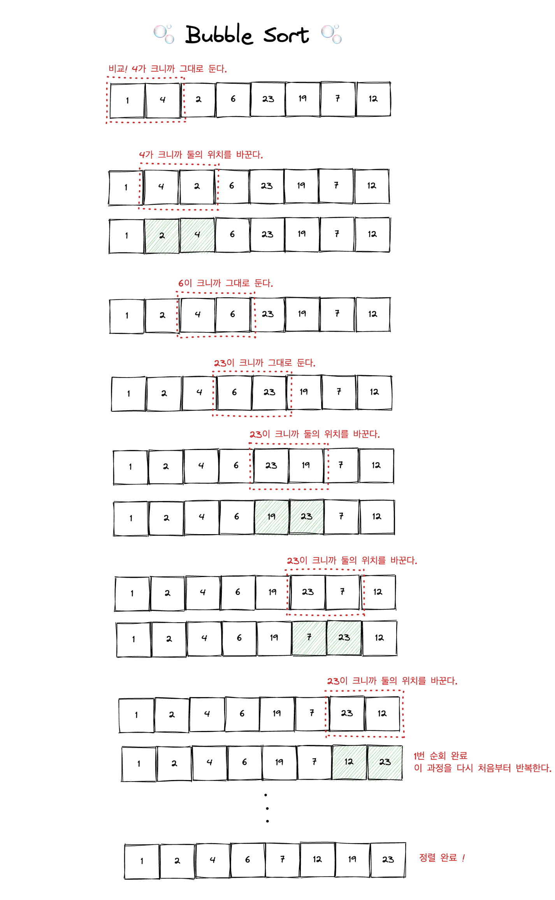

# Bubble Sort

배열 안에서 인접한 두 element의 크기를 비교해서 큰 element가 오른쪽으로 이동한다. (0번째 index와 1번째 index 비교, 1번째 index와 2번째 index 비교, 2번째 index와 3번째 index 비교, ....)

버블 정렬은 큰 값이 버블처럼 수면 위로 올라가는 모습을 한 정렬 알고리즘 중 하나이다.

버블 정렬은 **in-place** 알고리즘이기 때문에 메모리가 절약된다.

- Time Complexity: `O(n^2)`

- Space Complexity: `O(1)`

<br/>

### 버블 정렬 알고리즘 예시



<br/>

### 버블 정렬 코드 작성 예시

```js
function bubbleSort(array) {
	for (let i = 0; i < array.length - 1; i++) {
		// 순차적으로 비교
		for (let j = 0; j < array.length - 1 - i; j++) {
			// 반복문을 끝까지 돌았을 때 다시 처음부터 비교
			if (array[j] > array[j + 1]) {
				// 인접한 두 수를 비교해서 왼쪽이 오른쪽보다 크면
				const temp = array[j]; // 서로의 위치를 바꾼다
				array[j] = array[j + 1];
				array[j + 1] = temp;
			}
		}
	}
	return array;
}
```

<br/>

위의 코드에서 `j < array.length - 1 - i` 의 이유는, `array[j]` 와 `array[j + 1]` 를 비교하기 때문에 배열의 마지막 element 까지 확인하지 않아도 된다. (마지막에서 두번째 element 까지만 순회)

그리고 매번 순회가 끝날 때마다 i의 정렬은 완료되기 때문에 i를 빼줘야 한다.

위의 코드를 조금 리팩토링하면 아래와 같다.

```js
function bubbleSort(array) {
	for (let i = 0; i < array.length - 1; i++) {
		for (let j = 0; j < array.length - 1 - i; j++) {
			if (array[j] > array[j + 1]) {
				// here
				[array[j], array[j + 1]] = [array[j + 1], array[j]];
			}
		}
	}
	return array;
}
```

<br/>

그런데 이렇게 작성한 코드의 문제점은 원본 배열이 mutate 된다는 것이다. 그러므로 위에서 작성한 bubbleSort 함수는 **순수함수가 아니다**!

```js
const arr = [1, 4, 2, 6, 23, 4, 7, 12, 1829, 24, 238, 3, 186, 67, 92];

console.log(bubbleSort(arr));
console.log(arr); // 배열이 mutate 되었음을 알 수 있다.
```

<br/>

## ✅ bubbleSort를 순수함수로 구현

bubbleSort 함수를 **순수함수**로 만들기 위해 아래처럼 원본 배열을 shallow copy해서 코드를 작성할 수 있다.

```js
function bubbleSort(array) {
	const arr = array.slice(); // shallow copy
	for (let i = 0; i < arr.length - 1; i++) {
		for (let j = 0; j < arr.length - 1 - i; j++) {
			if (arr[j] > arr[j + 1]) {
				[arr[j], arr[j + 1]] = [arr[j + 1], arr[j]];
			}
		}
	}
	return arr;
}
```

<br/>

이렇게 하면 원본 배열은 mutate 되지 않는다.

```js
const arr = [1, 4, 2, 6, 23, 4, 7, 12, 24, 238, 3, 186, 67, 92, 1829];

console.log(bubbleSort(arr));
console.log(arr); // 원본 배열이 mutate 되지 않았음을 알 수 있다.
```
