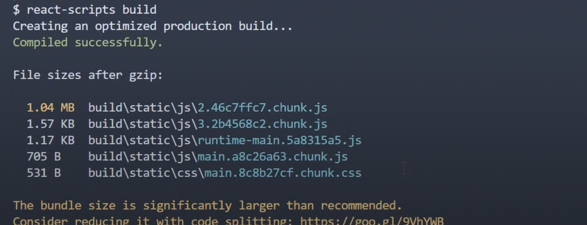

# Code Splitting

[React 공식 문서 Code Splitting](https://ko.reactjs.org/docs/code-splitting.html)

[Webpack 공식 문서 Code Splitting](https://webpack.kr/guides/code-splitting/)

React에서는 Webpack, Rollup과 같은 번들러를 이용해서 모든 컴포넌트를 하나의 파일 bundle.js 로 번들링을 한다.

이렇게 번들링 된 bundle.js 파일 하나로 웹 브라우저는 애플리케이션 전체를 한번에 받을 수 있다. (React는 Single Page Application 이다.) 이를 통해 사용자는 추가로 서버에 HTTP 요청을 하지 않아도 애플리케이션 내에서 navigate 할 수 있다.

문제는, 모던 웹으로 발전하면서 애플리케이션의 사이즈가 커졌다. npm으로 설치하는 서드파티 라이브러리도 포함이 되면서 번들링 되는 파일의 크기가 커지면서, 첫 화면이 렌더링 되는 시간이 길어지게 되었다.

이런 문제를 해결하기 위해 등장한 것이 **코드 분할(Code splitting)** 이다.

<br/>

> 코드 분할은 말 그대로 하나의 번들링 된 파일을 여러 조각으로 나눠서, 사용자가 한번에 전부를 받는 것이 아니라 필요한 것만 받을 수 있도록 하는 것을 말한다.

<br/>

Webpack에서 code splitting 기능을 지원한다.

Webpack 으로 리액트 프로젝트를 build 하면 결과는 대략 아래와 같이 몇 개의 파일로 번들링 된 것을 볼 수 있다.



<br/>

### 문제

이 파일들에 서드파티 라이브러리들도 포함이 되어있다.
이 파일들은 모두 브라우저에서 로딩이 되는데, 첫 화면에서 필요 없는 파일들도 함께 로딩이 된다. 즉, 로딩 시간이 길어지게 된다.

<br/>

### 해결 방법은?

첫 화면에서 필요한 코드만 로딩이 되게 한다.
그리고 애플리케이션에서 Router 로 분기된 컴포넌트로 사용자가 navigate 할 때, 그 때마다 필요한 코드를 비동기적으로 fetch 한다.

> 이런 문제를 `React.lazy()` 와 dynamic import 를 사용해서 해결할 수 있다.

<br/>
<br/>

## Static import 과 Dynamic import 의 차이

### Static import

```js
/* 기존의 static import는 파일의 최상위에서 import를 이용해 라이브러리 및 파일을 불러왔다. */
import moduleA from 'library';

form.addEventListener('submit', (e) => {
	e.preventDefault();
	someFunction();
});

const someFunction = () => {
	/* 그리고 코드 중간에서 불러온 파일을 사용 */
};
```

<br/>
<br/>

### Dynamic import

```js
form.addEventListener('submit', (e) => {
	e.preventDefault();
	/* 코드의 중간에서 불러올 수 있다. */
	import('library.moduleA')
		.then((module) => module.default)
		.then(someFunction())
		.catch(handleError());
});

const someFunction = () => {
	/* moduleA를 여기서 사용 */
};
```

- `then` 함수를 이용해 필요한 코드만 가져온다.
- 컴파일해야 하는 스크립트의 양이 줄어든다.
- `React.lazy()` 와 함께 사용할 수 있다.

<br/>
<br/>

### References

- https://ko.reactjs.org/docs/code-splitting.html
- https://webpack.kr/guides/code-splitting/
- https://www.youtube.com/watch?v=5ZFK_5V8VpI&ab_channel=Codevolution
