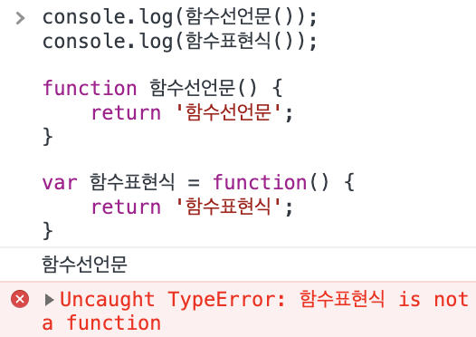

## 함수 선언문

```tsx
function add(a, b) {
	return a + b;
}
```

함수를 정의하는 가장 대표적인 방법이다. 다른 언어들도 함수 선언문으로 함수를 정의한다. 함수 선언문에서는 **함수 이름을 생략할 수 없다**.

```tsx
// 함수 선언문에서 함수 이름이 없을 경우
function (a, b) {
	return a + b;
}
// ❌ SyntaxError: Function statements require a function name
```

<br/>

## 함수 표현식

> 자바스크립트의 함수는 **일급 객체**다. 함수가 일급 객체라는 것은 **함수를 값처럼 자유롭게 사용할 수 있다**는 의미이다. 함수는 일급 객체이므로 함수 리터럴로 생성한 **함수 객체를 변수에 할당**할 수 있다.  
> 출처: 모던 자바스크립트 딥다이브 p.163

```tsx
var add = function (a, b) {
	return a + b;
};
```

함수 표현식은 **변수에 함수를 할당**하는 방식으로 함수를 정의한다.

→ 자바스크립트에서는 함수가 `일급 객체` 이기 때문에 가능한 것이다.

함수 표현식으로 만들어진 함수는 함수 이름을 생략하는 것이 일반적이다. 이렇게 이름이 없는 함수는 `익명함수(anonymous function)` 이라고 한다.

<br/>

## 함수 선언문과 함수 표현식의 차이점



1. `함수 생성 시점이 다르다`
2. 함수 선언문에서는 `함수 호이스팅`이 발생하고, 함수 표현식에서는 `변수 호이스팅`이 발생한다.

<br/>

### 함수 선언문으로 함수를 정의할 때

함수 객체가 **런타임 이전**에 생성된다.

1. (런타임 이전) 자바스크립트 엔진에 의해 런타임 이전에 함수 객체가 먼저 생성된다.
2. (런타임 이전) 자바스크립트 엔진은 함수의 이름과 같은 이름의 식별자를 암묵적으로 생성하고 함수 객체에 할당한다.
3. (런타임 이후) 따라서 런타임 이후 코드가 위에서부터 한 줄씩 실행될 때 이미 함수 객체가 생성되어 있고, 함수 이름과 같은 식별자에 함수 객체가 할당되어 있으므로 함수 선언문 이전에 함수를 호출할 수 있다. (`함수 호이스팅`)

<br/>

### 함수 표현식으로 함수를 정의할 때

함수 객체가 **런타임 이후** 생성된다. → 함수 표현식 이전에 함수 표현식으로 정의된 함수를 호출하면 `undefined`를 호출하는 것과 같아서 타입 에러가 발생한다.

1. (런타임 이전) 자바스크립트 엔진에 의해 런타임 이전에 `var`로 선언된 변수는 `undefined` 로 초기화 된다. (`변수 호이스팅`)
2. (런타임 이후) 변수 할당문의 값은 (이 경우에는 함수) 런타임에 평가되어 함수 객체가 된다.

<br/>

## References

모던 자바스크립트 딥다이브 p.158-166

[Function | PoiemaWeb](https://poiemaweb.com/js-function)
