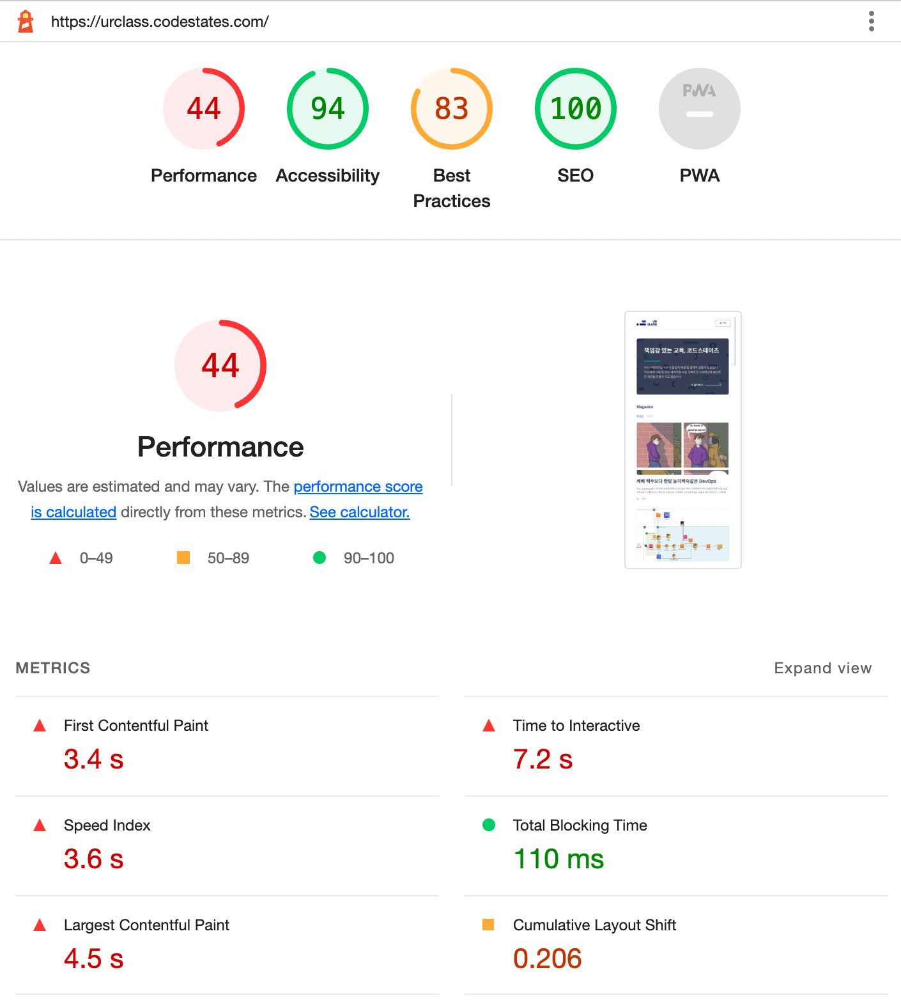
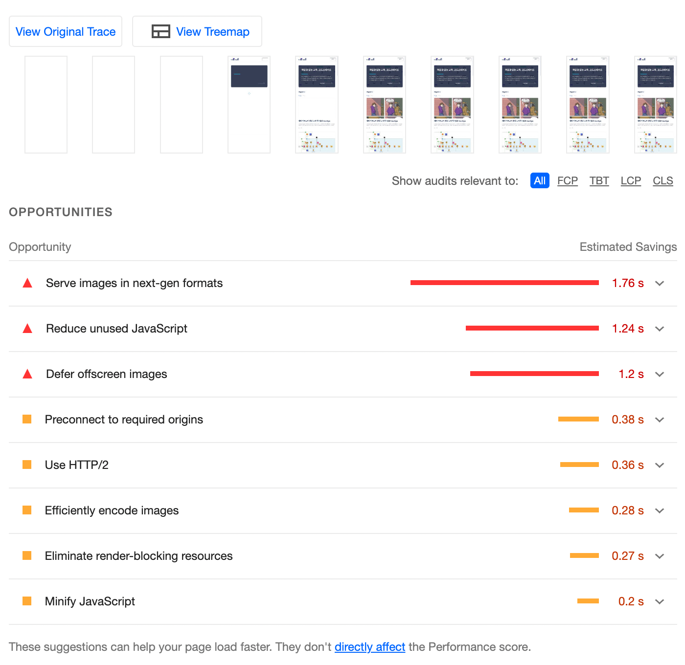
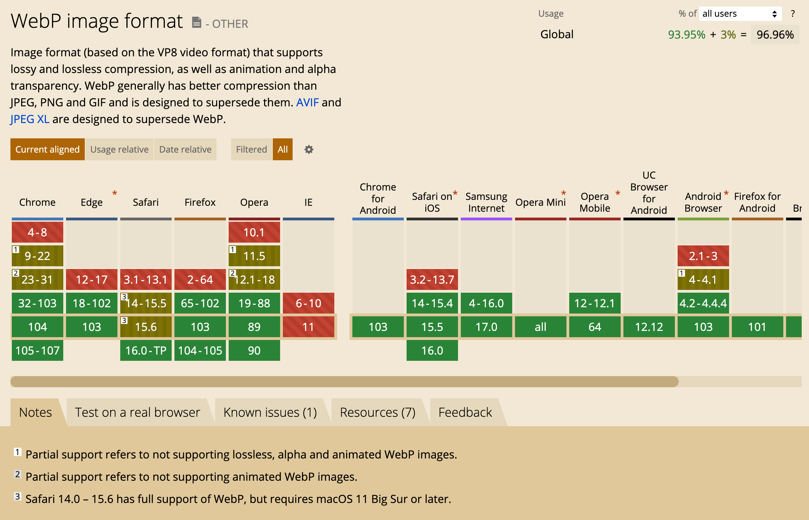
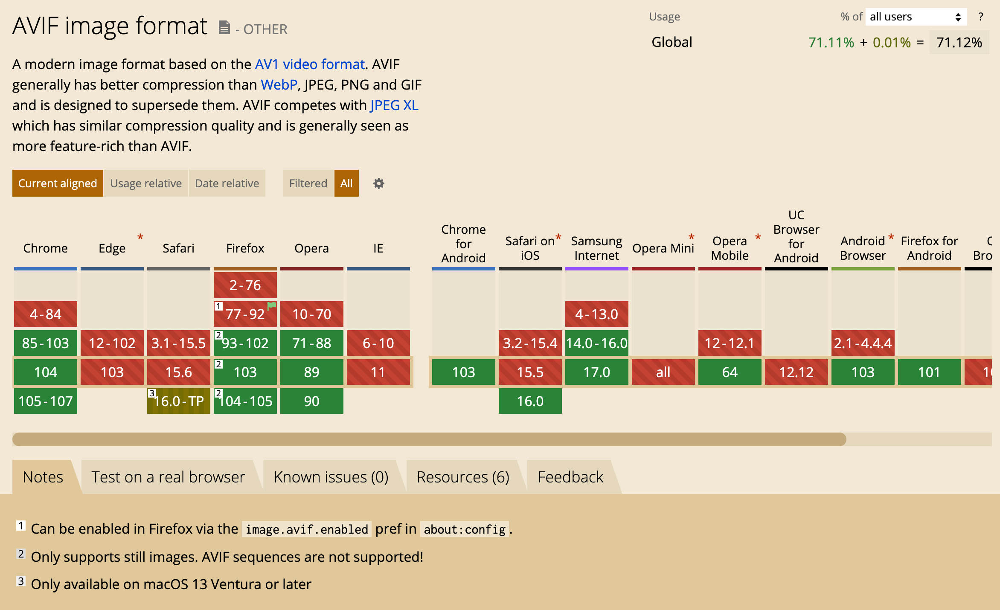
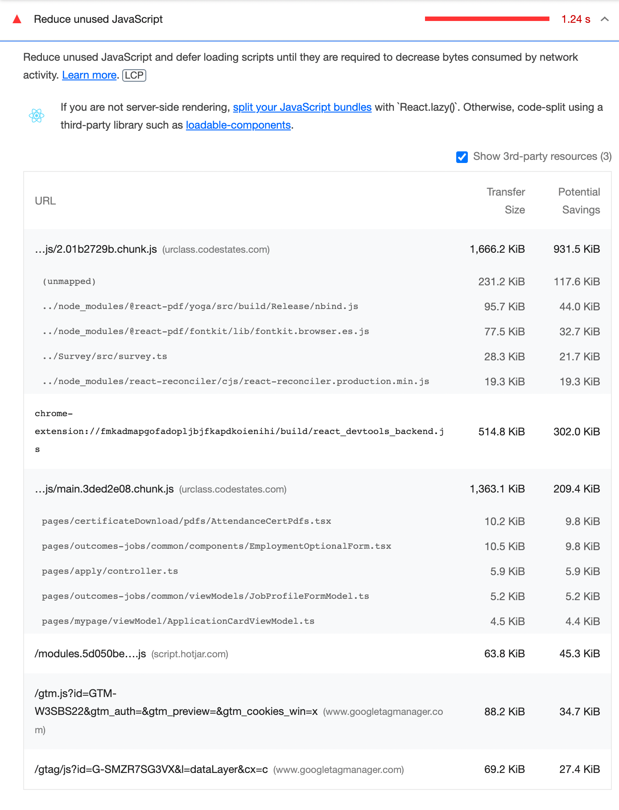
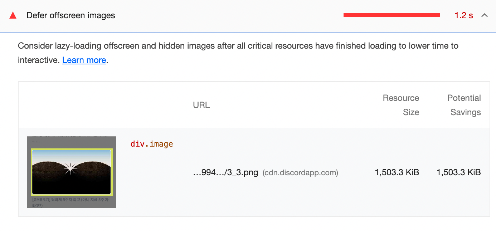

# Lighthouse

Lighthouse는 Google에서 웹페이지 최적화를 돕기 위해 개발한 오픈소스 자동화 툴이다.
Performance, Accessibility, SEO, PWA 등의 카테고리로 어떤 웹페이지이든 진단한다.

Lighthouse 를 사용하는 방법은 여러가지가 있다.

1.  Chrome의 개발자 도구 > Lighthouse 탭
2.  Node CLI

    ```js
    // 1. Lighthouse를 전역 모듈로 설치한다.
    npm install -g lighthouse

    // 2. 검사하고 싶은 웹페이지의 url를 입력한다. (https:// 포함)
    lighthouse <url>

    // 3. 옵션 보기
    lighthouse --help
    ```

    <br/>

# 🧪 Lighthouse 사용 예시





<br/>
<br/>

# Opportunities

Lighthouse 는 성능 측정 포함하여 어떤 항목들을 개선하면 파일 용량을 줄이고 로딩 시간을 단축할 수 있는지, 다시 말해 최적화를 어떻게 개선할 수 있는지를 Opportunites 섹션에서 해결첵을 제시해준다.

각 항목을 클릭하면 보다 자세한 설명이 나온다.

이 중 가장 흔하게 볼 수 있는 몇 가지의 Opportunites 항목들은 아래와 같다.

<br/>

## ✅ Serve images in next-gen formats


<br/>

- [Serve images in modern formats](https://web.dev/uses-webp-images/?utm_source=lighthouse&utm_medium=devtools)

- [Lighthouse: Serve images in next-gen formats](https://gtmetrix.com/serve-images-in-next-gen-formats.html)

<br/>

### 해결방법

### 1. `WebP` 또는 `AVIF` 이미지 포맷 사용

장점:

- jpeg, png 이미지 포맷 대신 WebP 또는 AVIF 이미지 포맷을 사용하면 **이미지의 용량을 감소**시킬 수 있다.
- WebP 는 png 와 비교하면 용량이 26% 감소, jpeg와 비교하면 용량이 25-35% 감소한다.
- AVIF 는 jpeg와 비교하면 용량이 50% 감소 WebP와 비교하면 20% 감소)

단점:

- 비교적 최근 등장한 이미지 포맷이기 때문에 모든 브라우저에서 호환 되지는 않는다.

  - WebP는 Safari 에서 지원되지 않는다.

    

  - AVIF 는 Chrome, Opera 등 소수의 브라우저에서만 지원된다.

    

<br/>

### 2. HTML의 `<picture>` 태그 사용

> 💡 `<picture>`: img 요소의 **다중 이미지 리소스(multiple image resources)를 위한 컨테이너를 정의**할 때 사용한다.

사용 예시 :

```html
<picture>
	<source srcset="logo.webp" type="image/webp" />
	<!-- WebP를 지원하지 않는 브라우저라면 이 source 태그는 무시된다. -->
	
</picture>
```

<br/>
<br/>

## ✅ Remove unused JavaScript



- [Remove unused JavaScript](https://web.dev/unused-javascript/)

- [How to remove unused JavaScript](https://web.dev/unused-javascript/#how-to-remove-unused-javascript)

<br/>

Lighthouse는 **20 kibibytes 이상**의 사용하지 않는 코드가 있는 모든 JavaScript 파일을 표시한다.

> 💡 1KiB = 1 킬로 이진 바이트 = 2^10 [바이트](https://ko.wikipedia.org/wiki/%EB%B0%94%EC%9D%B4%ED%8A%B8) = 1,024 바이트

<br/>

### 해결방법:

### 1. Code Splitting

당장에 사용하지 않는 코드는 Code Splitting 으로 처리한다. `React.lazy` 로 해결할 수 있다.

<br/>

### 2. Unused Code Elimination

[사용하지 않는 JavaScript 코드를 보는 방법](https://developer.chrome.com/docs/devtools/coverage/)

개발자도구에서 사용하지 않는 JavaScript 코드들을 확인할 수 있다. 불필요한 코드들은 제거한다.

<br/>

### 3. Unused Imported Code

서드 파티 라이브러리를 사용할 때, 전부를 받기 보다 필요한 것만 import 해서 사용한다.

<br/>
<br/>

## ✅ Defer offscreen images



- [Defer offscreen images(영어 문서)](https://web.dev/offscreen-images/?utm_source=lighthouse&utm_medium=devtools)

- [Defer offscreen images(한글 문서)](https://web.dev/i18n/ko/browser-level-image-lazy-loading/)

- [Image Lazy Loading 기법으로 웹 성능 최적화하기](https://onlydev.tistory.com/104)

<br/>

### 해결방법:

### Lazy loading offscreen images

사용자와 상호작용까지의 시간을 줄이기 위해 모든 중요한 리소스가 로딩이 완료된 이후 해당 이미지의 로딩을 지연시키는 것이 좋다.

<br/>

> 💡 **Lazy Loading** 이란? <br/>
> 페이지를 불러오는 시점에 당장 필요하지 않은 리소스들을 추후에 로딩하게 하는 기술

<br/>

즉, Lazy loading offscreen images(이미지 지연 로딩)은 사용자가 당장에 필요로 하지 않는 이미지들을 **나중에 사용자가 필요로 하는 시점에 로딩하게 하는 것**을 의미한다.

사용자가 필요로 하는 시점을 어떻게 알고 이미지를 로딩할까? 두 가지 방법이 있다.

1. **IntersectionObserver API** → 해당 이미지가 viewport 에 들어오자마자 로딩할 수 있도록 구현하는데 해당 API 사용할 수 있다.
2. **스크롤 이벤트 리스너**
