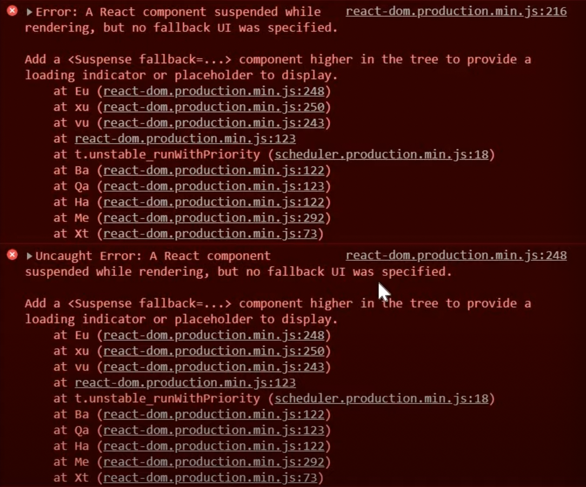

# React.lazy 와 Suspense

[React 공식문서 React.lazy](https://ko.reactjs.org/docs/code-splitting.html#reactlazy)

[React 공식문서 Route-based code splitting](https://ko.reactjs.org/docs/code-splitting.html#route-based-code-splitting)

<br>

React는 SPA(Single Page Application)이기 때문에 한 번에 모든 컴포넌트를 불러오는데, 사용하지 않는 컴포넌트까지 불러오기 때문에 단점이 있다.

## React.lazy

```js
// static import
import OtherComponent from './OtherComponent';

// dynamic import
const OtherComponent = React.lazy(() => import('./OtherComponent'));
```

- `React.lazy` 를 사용하면 dynamic import 를 사용해서 컴포넌트 렌더링을 할 수 있다.

  - 즉, 초기 렌더링 지연 시간을 어느 정도 줄일 수 있다.

- `React.lazy` 는 dynamic import를 호출하는 함수를 인자로 가진다. 이 함수는 Promise를 반환한다.
- `React.lazy` 는 `Suspense` 컴포넌트 하위에서 렌더링 되어야 한다.

<br/>

## Suspense

아래 사진은 `Suspense` 컴포넌트 없이 `React.lazy` 만 사용했을 때 콘솔에서 볼 수 있는 에러다.



- `Suspense` 컴포넌트는 아직 렌더링이 준비되지 않은 컴포넌트가 있으면 로딩 화면을 보여주고, 로딩이 끝나면 렌더링된 컴포넌트를 보여준다.
- `Suspense` 컴포넌트는 여러 개의 lazy 컴포넌트를 감쌀 수도 있다.
- `fallback` prop은 컴포넌트가 로딩이 완료되기 기다리는 동안 로딩 화면으로 보여줄 React element를 받아들인다.

<br/>

## 사용 예시

```js
/* suspense 기능을 사용하기 위해서는 import 해와야 합니다. */
import { Suspense } from 'react';

const OtherComponent = React.lazy(() => import('./OtherComponent'));
const AnotherComponent = React.lazy(() => import('./AnotherComponent'));

function MyComponent() {
	return (
		<div>
			<Suspense fallback={<div>Loading...</div>}>
				<OtherComponent />
				<AnotherComponent />
			</Suspense>
		</div>
	);
}
```
