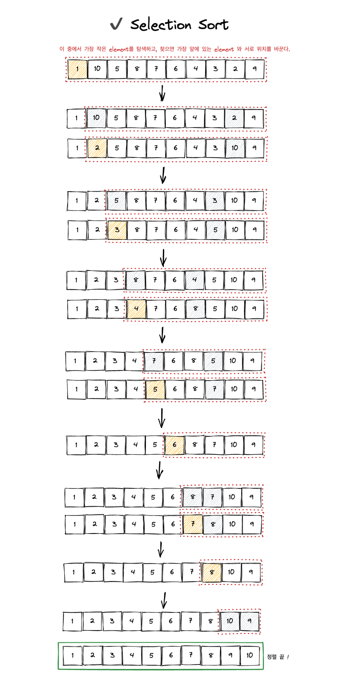

# Selection Sort

선택 정렬은 주어진 배열에서 최소값을 찾아 가장 앞으로 가져오는 과정을 반복하면서 정렬을 구현하는 알고리즘이다.

선택 정렬은 **in-place** 알고리즘이기 때문에 메모리가 절약된다.

- Time Complexity: `O(n^2)`

- Space Complexity: `O(1)`

<br/>

### Selection Sort 알고리즘

1. 주어진 배열 0번째 index부터 마지막까지 순회하며 최소값을 찾는다.
2. 찾은 최소값을 0번째 index의 값과 위치를 바꾼다.
3. 이제 0번째 index를 제외한 나머지 (1번째 index 부터 마지막)를 다시 순회하며 최소값을 찾는다.
4. 찾은 최소값을 1번째 index의 값과 위치를 바꾼다.
5. 모두 정렬이 될 때 까지 이런식으로 과정을 반복한다.

그림으로 이해하기 쉽게 표현해보았다.

<br/>



<br/>
<br/>

### Selection Sort 작성 예시

```js
function selectionSort(array) {
	for (let i = 0; i < array.length - 1; i++) {
		let minIndex = i; // 최소 값이 위치한 index를
		for (let j = i + 1; j < array.length; j++) {
			if (array[j] < array[minIndex]) {
				minIndex = j;
			}
		}

		const temp = array[i]; // swap
		array[i] = array[minIndex];
		array[minIndex] = temp;
	}
	return array;
}
```

<br/>

위의 코드를 리팩토링한다면 아래와 같다. (ES6 구조 분해 할당 사용)

```js
function selectionSort(array) {
	for (let i = 0; i < array.length - 1; i++) {
		let minIndex = i;
		for (let j = i + 1; j < array.length; j++) {
			if (array[j] < array[minIndex]) {
				minIndex = j;
			}
		}
		[array[i], array[minIndex]] = [array[minIndex], array[i]]; // 구조 분해 할당 활용해서 swap
	}
	return array;
}
```

```js
const arr = [2, 5, 34, 8, 23, 4, 1, 9, 12, 47, 2, 9, 10];

const output = selectionSort(arr);
console.log(output);
console.log(arr); // 원본 배열이 mutate 되었음을 알 수 있다.
```

그런데 위의 selectionSort 함수는 원본 배열을 mutate 하므로, 순수함수가 아니다.

순수함수에서는 전달받은 parameter 를 변경하면 안된다.

selectionSort 를 순수함수로 구현한다면 아래와 같다.

<br/>
<br/>

## ✅ selectionSort를 순수함수로 구현

selectionSort 함수를 순수함수로 만들기 위해 아래처럼 원본 배열을 shallow copy해서 코드를 작성할 수 있다.

```js
function selectionSort(array) {
	const arr = array.slice(); // shallow copy

	for (let i = 0; i < arr.length - 1; i++) {
		let minIndex = i;
		for (let j = i + 1; j < arr.length; j++) {
			if (arr[j] < arr[minIndex]) {
				minIndex = j;
			}
		}
		[arr[i], arr[minIndex]] = [arr[minIndex], arr[i]]; // swap
	}
	return arr;
}
```

이렇게 하면 원본 배열은 mutate 되지 않는다.

```js
const output = selectionSort(arr);
console.log(output);
console.log(arr); // 원본 배열이 mutate 되지 않았음을 알 수 있다.
```
